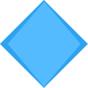
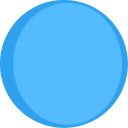
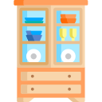
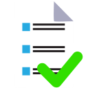
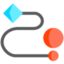
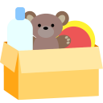
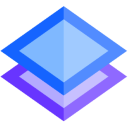

# Icon Attributions
The attributions below are for the graphical icons used in this project. All attributions follow the format provided by [https://www.flaticon.com](https://www.flaticon.com/) using their [instructions for attribution](https://support.flaticon.com/s/article/Attribution-How-when-and-where-FI?language=en_US#:~:text=Place%20the%20attribution%20on%20the,the%20post%20or%20post%20comments).

 Icon made by [Freepik](https://www.flaticon.com/authors/freepik) from [https://www.flaticon.com](https://www.flaticon.com/)

 Icon made by [Freepik](https://www.flaticon.com/authors/freepik) from [https://www.flaticon.com](https://www.flaticon.com/)

 Icon made by [Freepik](https://www.flaticon.com/authors/freepik) from [https://www.flaticon.com](https://www.flaticon.com/)

 Icon made by [Freepik](https://www.flaticon.com/authors/freepik) from [https://www.flaticon.com](https://www.flaticon.com/)

 Icon made by [Smashicons](https://www.flaticon.com/authors/smashicons)  from [https://www.flaticon.com](https://www.flaticon.com/)

 Icon made by [Freepik](https://www.flaticon.com/authors/freepik) from [https://www.flaticon.com](https://www.flaticon.com/)

 Icon made by [Freepik](https://www.flaticon.com/authors/freepik) from [https://www.flaticon.com](https://www.flaticon.com/)

 Icon made by [Freepik](https://www.flaticon.com/authors/freepik) from [https://www.flaticon.com](https://www.flaticon.com/)

 Icon made by [Freepik](https://www.flaticon.com/authors/freepik) from [https://www.flaticon.com](https://www.flaticon.com/)

 Icon made by [Freepik](https://www.flaticon.com/authors/freepik) from [https://www.flaticon.com](https://www.flaticon.com/)

 Icon made by [Freepik](https://www.flaticon.com/authors/freepik) from [https://www.flaticon.com](https://www.flaticon.com/)

 Icon made by [Freepik](https://www.flaticon.com/authors/freepik) from [https://www.flaticon.com](https://www.flaticon.com/)

 Icon made by [kliwir art](https://www.flaticon.com/authors/kliwir-art) from [https://www.flaticon.com](https://www.flaticon.com/)

 Icon made by [IYAHICON](https://www.flaticon.com/authors/iyahicon) from [https://www.flaticon.com](https://www.flaticon.com/)

 Icon made by [Freepik](https://www.flaticon.com/authors/freepik) from [https://www.flaticon.com](https://www.flaticon.com/)

 Icon made by [Freepik](https://www.flaticon.com/authors/freepik) from [https://www.flaticon.com](https://www.flaticon.com/)